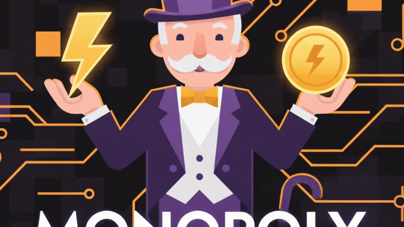

# ⚡ Cashu Monopoly 🎩


**A Peer-to-Peer Board Game powered by Bitcoin e-cash **

Cashu Monopoly takes the classic property trading game and adds **real stakes**. There is no central game server, no fake game currency, and no middlemen. The game logic runs entirely on the Host's device, communication happens via decentralized [Nostr](https://github.com/nostr-protocol/nostr) relays, and financial settlement is handled instantly via [Cashu](https://github.com/cashubtc) tokens.



## 🌟 Key Features

### 💰 Real-Money Economy
Unlike standard games where money is just a database entry, here **money is data**.
*   **Dynamic Pot:** The in-game economy scales based on the total buy-in.
*   **Bankruptcy:** If you lose in the game, you lose real value.
*   **Cash Out:** The winner takes the pot.

### 📡 Serverless P2P Multiplayer
This app requires **zero backend infrastructure**.
*   **The Host is the Server:** The game state lives in the Host's local browser storage.
*   **Nostr Transport:** All game moves (Roll Dice, Buy, Trade) are signed events sent over the decentralized [Nostr](https://github.com/nostr-protocol/nostr) network.
*   **Censorship Resistant:** No one can shut down the game server because *you* are the server.

### 🔐 Cryptographic Settlement (NIP-44)
When a remote player wins:
1.  The Host's device generates a **Cashu Token** (Bearer Asset) for the total pot.
2.  The token is **Encrypted** using the Winner's Nostr Public Key (NIP-44).
3.  It travels publicly over relays as "garbage text."
4.  Only the Winner's device can decrypt it and claim the funds.


### 👨‍👩‍👧‍👦 Why Play This?

This project is designed as a fun, interactive educational tool.

*   **Financial Literacy:** Teach children (and adults!) how to handle money, calculate inflows and outflows, and manage assets.
*   **Bitcoin Education:** It is the perfect safe sandbox to introduce friends and family to **Bitcoin, Lightning, and Ecash**.
*   **Micro-Stakes:** You can play with tiny amounts (e.g., 1000 sats, which is a fraction of a Dollar). This makes the game feel "real" and exciting without huge financial risk.
*   **Math Skills:** The game dynamically scales prices based on your buy-in. If you buy in with 3000 sats, all rents, salaries, and fines double automatically!

---

### 🏦 Bitcoin Banks

*   **Mint Agnostic:** Connect to any Cashu Mint (Minibits, TestNut, or your own local Docker mint).
*   **Dynamic Scaling:** The game math adjusts automatically. Play a "High Roller" game with 1,000,000 sats or a "Micro" game with 500 sats.
*   **Automatic Invoices:** Generates Lightning invoices (BOLT11) for buy-ins.
*   **Cash Out:** At the end of the game, the winner receives a Cashu token containing the entire pot. Redeem it using your Cashu wallet of choice (e.g. [Cashu.me](https://wallet.cashu.me/))
*   **Offline Mode:** Play offline against a local AI.

---

## 🚀 Getting Started

### Prerequisites
*   Node.js (v18+)
*   Android Studio (for mobile emulation)

### Installation

1.  **Clone the repo**
    ```bash
    git clone https://github.com/your-repo/cashu-monopoly.git
    cd cashu-monopoly
    ```

2.  **Install dependencies**
    ```bash
    npm install
    ```

3.  **Run in Browser (Development)**
    ```bash
    npm run dev
    ```

4.  **Build for Android**
    ```bash
    npm run build
    npx cap sync
    npx cap open android
    ```

---

## 🎮 How to Play

1.  **Fund Your Wallet:** Use the built-in wallet to mint Testnut (Testnet) or Minibits (Mainnet) tokens via Lightning Invoice.
2.  **Select Mode:**
    *   **vs Bot:** Local offline play against an AI.
    *   **Host:** Create a P2P lobby. You must define the buy-in amount.
    *   **Join:** Paste a Game ID from a friend.
3.  **Play:** Rules follow standard property trading mechanics.
4.  **Win:**
    *   **Host Wins:** Funds remain in the local wallet.
    *   **Joiner Wins:** A modal appears with the decrypted token. Copy it to cash out!

---


## ⚠️ Disclaimer

**This software is in BETA.**

*   **Do not** play with amounts you cannot afford to lose.
*   **Do not** use this for high-stakes gambling.
*   There is **no** cloud backup.
*   If you clear your browser cache or uninstall the app during a game, **funds will be lost.**
*   Use the "TestNut" mint for risk-free testing.

---

## 👑 Awards

The [original browser based version](https://github.com/bTCpy/monopoly) won the community choice award of the [nut november hackathon](https://nutnovember.org/).  


## ❤️ Credits

*   **Game Logic & UI:** [Daniel Moyer (intrepidcoder)](https://github.com/intrepidcoder/monopoly)
*   **Ecash Protocol:** [Cashu](https://cashu.space)
